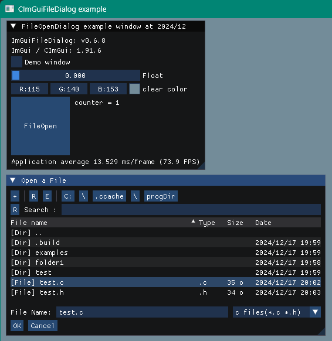

<!-- START doctoc generated TOC please keep comment here to allow auto update -->
<!-- DON'T EDIT THIS SECTION, INSTEAD RE-RUN doctoc TO UPDATE -->

- [CImGuiFileDialog](#cimguifiledialog)
  - [Screen shot](#screen-shot)
  - [Versions](#versions)
  - [Prerequisites](#prerequisites)
  - [Build and run](#build-and-run)

<!-- END doctoc generated TOC please keep comment here to allow auto update -->

## CImGuiFileDialog

ImGuiFileDialog example program with **C language**.

### Screen shot

---

[glfw_opengl3_fileopendialog source](examples/glfw_opengl3_fileopendialog/main.c)



### Versions

---

- ImGuiFileDialog  v0.6.8-dev (2024/12/05)  
git hash: c66089f509bbfbc0d8852d54106b1af88a104822
- CImGui/ImGui 1.91.6 (2024/12)

### Prerequisites

---

- Windows10 OS or later
- CMake installed 
- GCC compiler installed
- Make command installed

### Build and run

---

```sh
git clone --recurse-submodules https://github.com/dinau/CImGuiFileOpenDialog
```

```sh
cd CImGuiFileOpenDialog
cd examples/glfw_opengl3_fileopendialog
make
```
